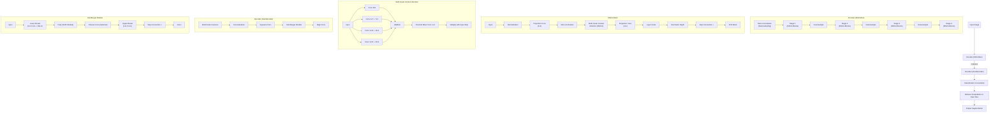

```mermaid
flowchart TB
    Input("Input Image") --> Encoder["Encoder (MSCANet)"]
    Encoder --> |Features| Decoder["Decoder (HamDecoder)"]
    Decoder --> ClsConv["Classification Convolution"]
    ClsConv --> Interpolate["Bilinear Interpolation to Input Size"]
    Interpolate --> Output["Output Segmentation"]
    
    subgraph "Encoder (MSCANet)"
        Stem["Stem Convolution\n(Downsampling)"] --> Stage1["Stage 1\n(MSCA Blocks)"]
        Stage1 --> Downsample1["Downsample"]
        Downsample1 --> Stage2["Stage 2\n(MSCA Blocks)"]
        Stage2 --> Downsample2["Downsample"]
        Downsample2 --> Stage3["Stage 3\n(MSCA Blocks)"]
        Stage3 --> Downsample3["Downsample"]
        Downsample3 --> Stage4["Stage 4\n(MSCA Blocks)"]
    end
    
    subgraph "MSCA Block"
        MSCA_in["Input"] --> MSCA_norm["Normalization"]
        MSCA_norm --> MSCA_proj1["Projection Conv\n(1x1)"]
        MSCA_proj1 --> MSCA_gelu["GELU Activation"]
        MSCA_gelu --> MSCA_att["Multi-Scale Context\nAttention (MSCA)"]
        MSCA_att --> MSCA_proj2["Projection Conv\n(1x1)"]
        MSCA_proj2 --> MSCA_ls["Layer Scale"]
        MSCA_ls --> MSCA_drop["Stochastic Depth"]
        MSCA_drop --> MSCA_add["Skip Connection +"]
        MSCA_add --> MSCA_ffn["FFN Block"]
    end
    
    subgraph "Multi-Scale Context Attention"
        ATT_in["Input"] --> ATT_5x5["Conv 5x5"]
        ATT_in --> ATT_1x7["Conv 1x7 + 7x1"]
        ATT_in --> ATT_1x11["Conv 1x11 + 11x1"]
        ATT_in --> ATT_1x21["Conv 1x21 + 21x1"]
        ATT_5x5 & ATT_1x7 & ATT_1x11 & ATT_1x21 --> ATT_add["Addition"]
        ATT_add --> ATT_mix["Channel Mixer Conv 1x1"]
        ATT_mix --> ATT_mult["Multiply with Input Skip"]
    end
    
    subgraph "Decoder (HamDecoder)"
        Dec_in["Multi-Scale Features"] --> Dec_cat["Concatenation"]
        Dec_cat --> Dec_squeeze["Squeeze Conv"]
        Dec_squeeze --> Dec_ham["HamBurger Module"]
        Dec_ham --> Dec_align["Align Conv"]
    end
    
    subgraph "HamBurger Module"
        Ham_in["Input"] --> Ham_low["Lower Bread\n(1x1 Conv + ReLU)"]
        Ham_low --> Ham_patty["Patty (NMF Module)"]
        Ham_patty --> Ham_cheese["Cheese Conv (Optional)"]
        Ham_cheese --> Ham_up["Upper Bread\n(1x1 Conv)"]
        Ham_up --> Ham_add["Skip Connection +"]
        Ham_add --> Ham_relu["ReLU"]
    end
``` 